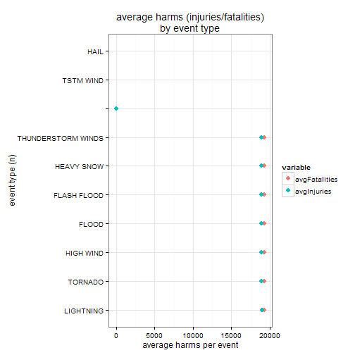
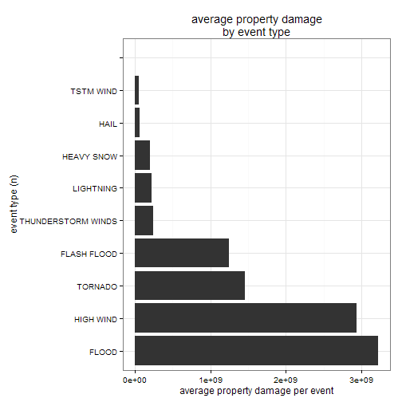

# Weather-related Casualties and Damages in the U.S.
###==================================================================
## Reading data

```r
setwd("H:\\–ÌÍ…\\Rprogramming\\Github\\RepData_PeerAssessment2")
library(stringr)
library(dplyr)
```

```
## Warning: package 'dplyr' was built under R version 3.1.1
```

```
## 
## Attaching package: 'dplyr'
## 
## The following objects are masked from 'package:stats':
## 
##     filter, lag
## 
## The following objects are masked from 'package:base':
## 
##     intersect, setdiff, setequal, union
```

```r
library(reshape2)
```

```
## Warning: package 'reshape2' was built under R version 3.1.1
```

```r
library(ggplot2)
if (!file.exists("stormData.csv.bz2")){
   setInternet2(use = TRUE)
download.file("https://d396qusza40orc.cloudfront.net/repdata%2Fdata%2FStormData.csv.bz2", "stormData.csv.bz2")     
}
rawStorm = read.csv("StormData.csv",header = TRUE, sep = ",")
```

```
## Warning: EOF within quoted string
```
### let's take a peek at the data:

```r
summary(rawStorm)
```

```
##     STATE__                    BGN_DATE             BGN_TIME     
##  48.00  : 57083                    : 21722              : 54364  
##  20.00  : 34590    Western         :   969   12:00:00 AM:  5155  
##  40.00  : 33863   5/31/1998 0:00:00:   933   1600       :  4981  
##  29.00  : 21656   5/30/2004 0:00:00:   844   1700       :  4907  
##  31.00  : 19495   5/6/2003 0:00:00 :   830   1800       :  4862  
##  19.00  : 18291   5/18/1995 0:00:00:   766   1500       :  4688  
##  (Other):507310   (Other)          :666224   (Other)    :613331  
##    TIME_ZONE          COUNTY            COUNTYNAME         STATE       
##  CST    :369637          : 80043             : 89621          : 94785  
##  EST    :120261   1.00   : 10844   JEFFERSON :  5156   TX     : 57083  
##         : 69798   3.00   :  9431   WASHINGTON:  4888   KS     : 34589  
##  MST    : 32942   15.00  :  8383   JACKSON   :  4371   OK     : 33863  
##  PST    : 17174   5.00   :  8177   FRANKLIN  :  3872   MO     : 21656  
##  AST    :  4068   19.00  :  8124   LINCOLN   :  3864   NE     : 19495  
##  (Other): 78408   (Other):567286   (Other)   :580516   (Other):430817  
##                 EVTYPE         BGN_RANGE         BGN_AZI      
##  TSTM WIND         :189928   0.00   :442323          :548086  
##  HAIL              :180954          :102892   N      : 17593  
##                    : 99497   2.00   : 15286   S      : 16822  
##  TORNADO           : 49289   5.00   : 14022   W      : 15788  
##  FLASH FLOOD       : 27451   3.00   : 13307   E      : 12658  
##  THUNDERSTORM WINDS: 20843   1.00   : 11928   SW     :  9505  
##  (Other)           :124326   (Other): 92530   (Other): 71836  
##            BGN_LOCATI                   END_DATE             END_TIME     
##                 :339853                     :354066              :351310  
##  COUNTYWIDE     : 16800   5/31/1998 0:00:00 :   948   06:00:00 PM:  5715  
##  Countywide     :   993   5/6/2003 0:00:00  :   845   04:00:00 PM:  4837  
##  SOUTH PORTION  :   626   5/30/2004 0:00:00 :   826   05:00:00 PM:  4690  
##  NORTH PORTION  :   621   5/10/2003 0:00:00 :   738   03:00:00 PM:  4143  
##  CENTRAL PORTION:   519   10/24/2001 0:00:00:   730   08:00:00 PM:  4001  
##  (Other)        :332876   (Other)           :334135   (Other)    :317592  
##                                                                                                                                                              COUNTY_END    
##  0.00                                                                                                                                                             :547363  
##                                                                                                                                                                   :113922  
##   damaging winds                                                                                                                                                  :    93  
##   Dekalb                                                                                                                                                          :    89  
##   even knocked down the primary radio tower                                                                                                                       :    71  
##   some for as long as 5 days.  They had to bring in work crews from out of state to help restore power.    Damage estimates for Tarrant County were well over $100:    68  
##  (Other)                                                                                                                                                          : 30682  
##                                                                                                  COUNTYENDN    
##                                                                                                       :662534  
##   damaging winds                                                                                      :    98  
##   and Gwinnett.  Rainfall amounts of 8 to 12 inches were noted in other more spotty areas of northwest:    89  
##  000                                                                                                  :    79  
##   for the Missouri State Patrol in St. Joseph                                                         :    71  
##   as provided to the Milwaukee/Sullivan WFO (monetary value of claims and number of claims)           :    61  
##  (Other)                                                                                              : 29356  
##    END_RANGE         END_AZI                 END_LOCATI    
##  0.00   :456658          :573668                  :397783  
##         :116256   N      : 15109   COUNTYWIDE     : 16809  
##  2.00   : 12865   S      : 14256   SOUTH PORTION  :   637  
##  5.00   : 11980   W      : 12658   NORTH PORTION  :   619  
##  3.00   : 11375   E      : 11517   CENTRAL PORTION:   495  
##  1.00   : 10031   NE     :  7756   JACKSON        :   400  
##  (Other): 73123   (Other): 57324   (Other)        :275545  
##      LENGTH           WIDTH              F               MAG        
##  0.00   :505073   0.00   :498142          :620317   0.00   :256605  
##         :118990          :119718   0      : 18670          :120931  
##  0.10   :  7119   33.00  : 10143   1      : 15991   75.00  : 63396  
##  1.00   :  4349   50.00  :  6123   2      :  8766   175.00 : 38653  
##  0.50   :  4280   100.00 :  4752   3      :  2825   100.00 : 38268  
##  0.20   :  3850   10.00  :  4221   4      :   995   50.00  : 28499  
##  (Other): 48627   (Other): 49189   (Other): 24724   (Other):145936  
##    FATALITIES        INJURIES         PROPDMG      
##  0.00   :542593   0.00   :533330   0.00   :410406  
##         :121459          :121959          :122439  
##  1.00   :  3308   1.00   :  5869   5.00   : 19516  
##  2.00   :   703   2.00   :  2511   25.00  : 12900  
##  3.00   :   246   3.00   :  1296   10.00  : 11041  
##  4.00   :   123   4.00   :   774   50.00  :  8939  
##  (Other): 23856   (Other): 26549   (Other):107047  
##            PROPDMGEXP        CROPDMG      
##                 :518080   0.00   :533162  
##  K              :144484          :123381  
##  M              :  7402   5.00   :  2970  
##  0              :   215   50.00  :  1355  
##   damaging winds:    81   10.00  :  1348  
##   large hail    :    62   2.00   :   802  
##  (Other)        : 21964   (Other): 29270  
##                                                                                                                                                                        CROPDMGEXP    
##                                                                                                                                                                             :649722  
##  K                                                                                                                                                                          : 20189  
##  M                                                                                                                                                                          :  1190  
##   damaging winds                                                                                                                                                            :    85  
##   large hail                                                                                                                                                                :    60  
##   to central Milwaukee County by 2210CST.  This storm produced hailstones up to 1.5 inch in diameter.  The third hailstorm developed in southern Dodge County around 2056CST:    32  
##  (Other)                                                                                                                                                                    : 21010  
##       WFO                                            STATEOFFIC    
##         :266211                                           :373280  
##  AT     : 12212   OKLAHOMA, Western, Central and Southeast:  8070  
##  ATA    :  9589   KANSAS, Southwest                       :  6157  
##  OUN    :  9224   TEXAS, North                            :  6042  
##  T      :  7166   ARKANSAS, Central and North Central     :  5942  
##  JAN    :  7013   GEORGIA, North and Central              :  5831  
##  (Other):380873   (Other)                                 :286966  
##                                                            ZONENAMES     
##                                                                 :633600  
##  GREATER LAKE TAHOE AREA - GREATER LAKE TAHOE AREA              :   397  
##  GREATER RENO / CARSON CITY / M - GREATER RENO / CARSON CITY / M:   390  
##  MADISON - MADISON                                              :   195  
##  EASTERN BARANOF ISLAND AND SOU - EASTERN BARANOF ISLAND AND SOU:   189  
##  GLACIER BAY - GLACIER BAY                                      :   187  
##  (Other)                                                        : 57330  
##     LATITUDE        LONGITUDE        LATITUDE_E       LONGITUDE_    
##  0.00   :146503   0.00   :146504   0.00   :324061   0.00   :324061  
##         :125181          :125479          :125789          :126075  
##  3512.00:  1093   9724.00:   900   3742.00:   470   9720.00:   384  
##  3335.00:   970   9735.00:   865   4140.00:   453   9732.00:   364  
##  3947.00:   967   9830.00:   751   3526.00:   450   9557.00:   358  
##  3430.00:   940   9647.00:   715   3609.00:   438   9707.00:   341  
##  (Other):416634   (Other):417074   (Other):240627   (Other):240705  
##                                            REMARKS      
##                                                :389765  
##                                                : 24013  
##  Trees down.\n                                 :   746  
##  Several trees were blown down.\n              :   477  
##  Large trees and power lines were blown down.\n:   431  
##  A few trees were blown down.\n                :   316  
##  (Other)                                       :276540  
##                                                               REFNUM      
##                                                                  :126641  
##   damaging winds                                                 :    75  
##   large hail                                                     :    53  
##   given that the growing season had not started as of April 13th.:    32  
##   moist                                                          :    26  
##   flash flooding                                                 :    17  
##  (Other)                                                         :565444
```

```r
# convert crop and property amounts into total dollars based on EXP fields
# first change all char values to lower case
rawStorm$PROPDMGEXP = tolower(rawStorm$PROPDMGEXP)

rawStorm$PROPDMGEXP = gsub('-', 0, rawStorm$PROPDMGEXP)
rawStorm$PROPDMGEXP = gsub('h', 2, rawStorm$PROPDMGEXP)
rawStorm$PROPDMGEXP = gsub('k', 3, rawStorm$PROPDMGEXP)
rawStorm$PROPDMGEXP = gsub('m', 6, rawStorm$PROPDMGEXP)
rawStorm$PROPDMGEXP = gsub('b', 9, rawStorm$PROPDMGEXP)

rawStorm$PROPDMGEXP = as.numeric(rawStorm$PROPDMGEXP)
```

```
## Warning: NAs introduced by coercion
```

```r
rawStorm$PROPDMGEXP[is.na(rawStorm$PROPDMGEXP) == TRUE] = 0

# calculate new property damage
rawStorm$propDamage = ( as.numeric(rawStorm$PROPDMG) * ( 10 ^ rawStorm$PROPDMGEXP ) )
```

## Results
### Which events are most harmful to pop. health?

```r
# create data frame of total and average population harms by event type
harmByEvent = rawStorm %.%
  group_by(EVTYPE) %.%
  summarize(cntEvents = n(), totalFatalities = sum(FATALITIES), totalInjuries = sum(INJURIES), 
            avgFatalities = totalFatalities / cntEvents, avgInjuries = totalInjuries / cntEvents )

# order by occurence of event
harmByEvent = arrange(harmByEvent, -cntEvents)

# convert event types to lowercase format
harmByEvent$EVTYPE = paste( tolower(harmByEvent$EVTYPE), " (", harmByEvent$cntEvents, ")" )
```

```
## Error: invalid multibyte string 4216
```

```r
# plot top ten
# create plot data frame and melt (for easier plotting)
dfPlot = melt(harmByEvent[1:10,][c('EVTYPE', 'avgFatalities', 'avgInjuries')], id.vars='EVTYPE')

dfPlot = arrange(dfPlot, variable, -value)

# plot top ten events
ggplot(dfPlot, aes(x = EVTYPE, y = value, color = variable)) + 
  geom_point(stat = 'identity', size = 3) + 
  scale_x_discrete(limits = dfPlot$EVTYPE[1:10]) + 
  coord_flip() +
  xlab('event type (n)') + ylab('average harms per event') + 
  theme_bw() + 
  ggtitle('average harms (injuries/fatalities)\nby event type')
```

```
## Warning: Removed 4 rows containing missing values (geom_point).
```

 
Of the most prevalent weather event types, tornadoes not only have the highest average deaths per event, but also the highest average injuries per event - and by a wide margin.
### Which events are most harmful to economy?

```r
# create data frame of property damage by event type  
costByEvent = rawStorm %.%
  group_by(EVTYPE) %.%
  summarize(cntEvents = n(), totalPropDamage = sum(propDamage), avgPropDamage = totalPropDamage / cntEvents )

# order by occurence of event
costByEvent = arrange(costByEvent, -cntEvents)

# convert event types to lowercase format
costByEvent$EVTYPE = paste0( tolower(costByEvent$EVTYPE), " (", costByEvent$cntEvents, ")" )
```

```
## Error: invalid multibyte string 4216
```

```r
# plot top ten
# create plot data frame
dfCostPlot = costByEvent[1:10, ]
dfCostPlot = arrange(dfCostPlot, -avgPropDamage)

# plot top ten events
ggplot(dfCostPlot, aes(x = EVTYPE, y = avgPropDamage) ) +
  geom_bar(stat = 'identity') + 
  scale_x_discrete(limits = dfCostPlot$EVTYPE[1:10]) + 
  coord_flip() +
  xlab('event type (n)') + ylab('average property damage per event') + 
  theme_bw() + ggtitle('average property damage\nby event type')
```

 
Of the most prevalent weather event types, floods have the highest average property damage per event. Tornadoes come in a distance second, followed by flash floods 
